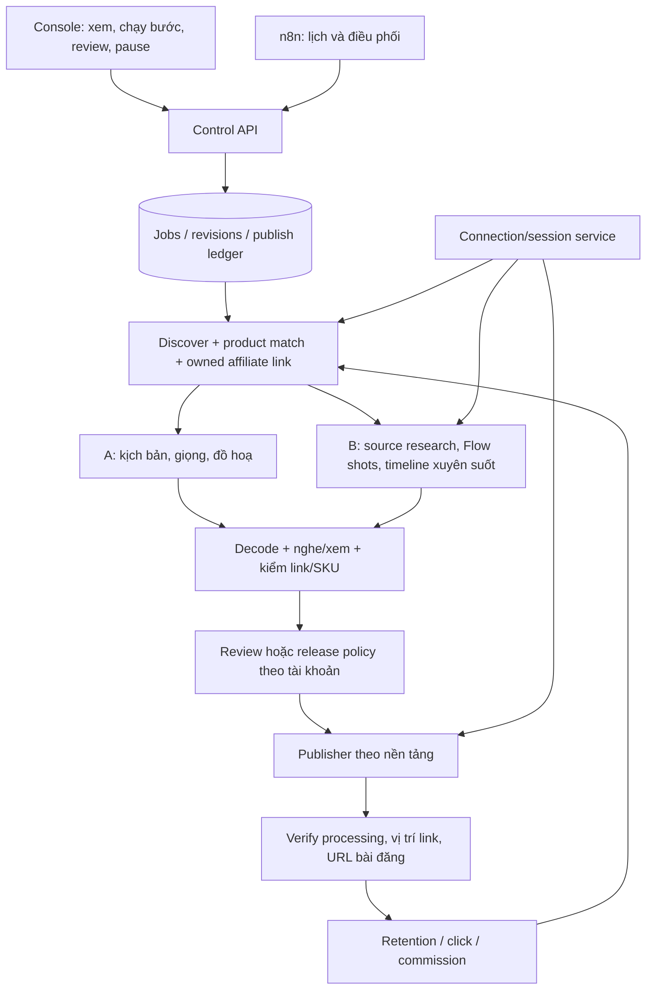

# Kiến trúc đích và bản đã triển khai

## Bản hiện tại trong repo

Console → control API → adapter gọi đúng runner legacy.
Control API đọc health/queue/báo cáo và lưu lịch sử riêng. Chỉ ba hành động được
cho phép: trends, media, readiness. Không có arbitrary command, URL hoặc file path
truyền từ trình duyệt tới runner. UI không có endpoint công khai video.

## Đích sau migration

## Quyền sở hữu theo module

| Module | Sở hữu | Không sở hữu |
|---|---|---|
| console | preview, review, account/topic routing, lịch sử | token, logic render |
| control-api | phiên quản trị, run reserve, quyền thao tác, trạng thái | browser cookies hoặc thuật toán dựng |
| domain | product/media/link/post contracts, transition rules | HTTP, filesystem credentials, Docker |
| n8n | schedule, dependency giữa bước, retry safe reads, gửi ID job | giọng, render, secret trong Code node |
| connectors | OAuth/API capability và refresh; session status | chọn nội dung hoặc tự bật thanh toán |
| browser-worker (phase 3) | local persistent profile, mở login, thao tác UI Flow hợp lệ | export cookie hoặc xoá nguồn của video khác |
| media-worker (phase 4) | voice/captions/graphics/Flow composition/QC | publish, sửa link tài khoản |
| publisher (phase 5) | upload reserve, account identity, final URL, reconciliation | tạo nội dung hoặc suy doanh thu |

## Trạng thái và dữ liệu

Job: discovered → product_matched → link_verified → brief_ready → producing →
qc_ready → review_ready → approved → publishing → published_verified → measured.
Các trạng thái phụ: needs_owner, blocked, failed, interrupted, paused.

Mỗi bước có run_id, batch_id, job_id, revision, input_hash, artifact_sha256,
started_at/completed_at, nguồn bằng chứng và expires_at. Bất kỳ sửa media/copy/
SKU/account/link nào tạo revision và vô hiệu approval cũ. Review gắn đúng mã băm.

Publish ledger unique(account_id, platform, job_id, revision). Timeout sau upload
chuyển uncertain và reconcile; không tự gửi lại tệp. Khóa daily batch duy nhất
theo topic/account/local_date; cron không tạo thêm batch khi người dùng click lại.

## Tự động và kiểm soát

Hai chế độ theo account/topic: review (giữ bản sẵn sàng) và auto (tự release khi
đủ điều kiện của cấu hình đã chọn). Owner có thể pause lịch, reject từng revision,
sửa brief rồi tạo revision mới, chạy từng bước, hoặc chạy batch tổng hợp.
Không bắt người dùng review mọi batch nếu đã chọn auto cho account đó.

Session hết hạn/CAPTCHA, thiếu quyền nguồn, thiếu tín dụng hoặc scope xuất bản
đưa đúng bước vào needs_owner. Các job khác vẫn tiếp tục khi không phụ thuộc.
Một hệ thống có thể vận hành tự động hằng ngày nhưng không thể bảo đảm web Flow
không bao giờ yêu cầu chủ tài khoản đăng nhập/xác minh lại.

## Chuyển đổi không gián đoạn

Legacy→adapter→module mới→shadow run→đối chiếu→chuyển một schedule→ngừng bản cũ.
Console hiện không sửa scheduler live. Tất cả chuyển lịch phải ghi vào deployment
ledger; không chạy song song hai publisher cho cùng publish key.
