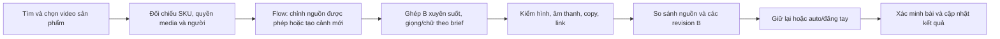

# Kế hoạch B-only — lịch sử, đã bị thay thế

Không dùng phạm vi B-only cho batch mới. Chủ làm rõ sau tài liệu này: một video
tự làm và một video chọn từ danh sách. Xem [workflow hiện hành](two-video-workflow.md).
Nội dung dưới đây giữ để đối chiếu quyết định trước đó, không là chỉ thị triển khai.

Cập nhật 04/10/2026 theo các yêu cầu mới nhất. Đây là đặc tả/cổng nghiệm thu,
không phải xác nhận tất cả chức năng đã triển khai. Thay thế hướng A/B của kế hoạch cũ.
Đọc [bảng đối chiếu yêu cầu](requirements-matrix.md), [ca kiểm thử](workflow-cases.md)
và [hợp đồng số liệu](metrics-contract.md) cùng tài liệu này.

## 1. Phạm vi đã chốt và phần thực tế đang có

- Chỉ tạo **B** cho nội dung tương lai: video hình ảnh/chuyển động xuyên suốt,
  xử lý nguồn được phép dùng trong Flow hoặc tạo cảnh Flow mới. Không trở về đồ hoạ A.
- Không tự tạo hai đầu ra để thay thế yêu cầu cũ. So sánh là nguồn ↔ bản B ↔ revision
  trước; có thể tạo thêm B khi chủ yêu cầu, không phát sinh nhánh A ngầm.
- “Nhạy cảm” đã được chủ làm rõ là **gây chú ý/gây tranh luận, không phải tình dục**.
  Giữ hướng sáng tạo táo bạo, bất ngờ, trái kỳ vọng, nhưng phải gắn đúng sản phẩm.
- Chủ có thể đổi nguồn, chỉnh nội dung, làm lại, giữ lại hoặc đăng. Mặc định mục tiêu
  là auto cho bản B đủ điều kiện; không bắt duyệt tay mọi bản nếu route đã bật auto.
- Ngân sách tiền mới bằng 0. Giữ tài khoản, dịch vụ, bài đăng và mã băm cũ.
  Không xoá video A lịch sử hoặc biến nó thành B bằng cách đổi nhãn.

Hiện có console localhost:8787, API phiên/CSRF, lịch sử chạy, adapter ba workflow
legacy và kiểm tra hợp đồng link. Runtime có bộ dựng B độc lập nhưng chưa nối vào
hàng đợi production. Bản UpuhDyQmhQM chỉ có intro, không đạt B hiện hành.
Nguồn Google Trends đang có chưa phải collector danh sách video sản phẩm.
Lượt đọc YouTube trước báo lỗi xác thực; worker vẫn không cho public publish.
Login xã hội trong Settings, face-edit runner và toàn bộ UI dưới đây chưa triển khai.

## 2. Bố cục trang quản lý — bảy khu vực cố định

Thanh bên luôn thấy các khu vực; đầu trang có tài khoản/chủ đề đang xem, trạng thái
dữ liệu và liên kết hướng dẫn. Người dùng không phải biết tên node hoặc workflow ID.

| Khu vực | Nội dung nhìn thấy | Nút/thao tác |
|---|---|---|
| Tổng quan | số sản phẩm, nguồn tìm được, đang xử lý, B chờ đăng, công khai, lỗi/chờ chủ | mở đúng nhóm; chạy batch; tạm dừng lịch thuộc dự án |
| Nội dung tổng hợp | văn bản, ảnh sản phẩm/biến thể, link sàn và link affiliate của chủ, nguồn/tuổi bằng chứng, danh sách video | sửa brief/copy; tìm lại; xem nguồn; đổi video được chọn; sang xử lý |
| Đang xử lý | timeline lấy media → chuẩn bị Flow → edit/tạo cảnh → ghép → âm thanh/chữ → QC/copy/link | xem kết quả từng bước; tạm dừng; thử lại bước an toàn; quay lại chọn nguồn |
| B đã xử lý, chờ đăng | video hoàn chỉnh, nguồn và revision trước cạnh nhau, copy/hashtag/CTA/link placement, route/lịch/cảnh báo | giữ lại; sửa/làm lại; đổi nguồn; đăng ngay; hẹn giờ |
| Đã đăng | bài theo SKU/account/platform, URL thật, giờ đăng/quyền xem, revision/hash, copy/link đã dùng | mở bài; đối chiếu lại; tạo revision mới; không có đăng lại mù |
| Kết quả đăng | views/tương tác/retention/click/đơn/hoa hồng có nguồn, kỳ/coverage và đồ thị | **Cập nhật kết quả mới nhất**; lọc SKU/bài/account/ngày; xem lỗi đọc nguồn |
| Settings & Hướng dẫn | tìm kiếm, prompt, tài khoản/khóa, lịch, route, âm thanh, quyền nguồn và trạng thái dịch vụ | lưu phiên bản; đăng nhập/kết nối lại; kiểm tra khả năng; tiếp tục bước đang chờ |

Mọi card có “Đang ở bước nào”, “Còn thiếu gì” và “Tiếp theo làm gì”. Dữ liệu chưa có
khác lỗi kết nối. Nút disabled giải thích lý do, không biến lỗi thành thông báo thành công.
Desktop có bảng/preview song song; mobile có thẻ xếp dọc, nút đủ lớn, nhãn tiếng Việt.
Có empty/loading/error/partial/stale states, điều khiển bàn phím và thông báo dễ đọc.
Nút làm mới màn hình chỉ đọc DB; nút cập nhật kết quả mới tạo sync run thật.

## 3. Nội dung tổng hợp, tìm kiếm và đề cử nguồn

Một batch gắn sản phẩm/biến thể + topic + profile tìm kiếm + route. Hình, lời giới
thiệu và claim đều đi cùng nguồn; link affiliate phải thuộc chủ, đúng shop/item/variant.
Đầu vào nhiều sản phẩm không dùng chung link M31 hoặc chọn “link đầu tiên” như legacy.

Danh sách video giữ: URL chuẩn, provider/video ID, người đăng, tiêu đề, thumbnail nếu
nguồn cho phép, thời lượng, ngày đăng, query đã tìm, ngày thu thập, SKU match, metrics
quan sát được, quyền dùng media/âm thanh và mức gây chú ý kèm giải thích.
Không lấy view chưa đọc được làm 0, hoặc suy tổng view thành tốc độ tăng/doanh số.
Mọi kết quả trả về từ connector có thể xem, kể cả bị đánh dấu chưa đủ điều kiện xử lý.
Không âm thầm sửa query hoặc ẩn video chỉ vì cách nói gây tranh luận.

Settings chứa query nguyên văn, ngôn ngữ/khu vực, nguồn ưu tiên, thời gian, giới hạn
kết quả, tiêu chí đề cử và prompt. Hiển thị query thực sự gửi và lý do provider từ chối.
RSS tìm kiếm không thay thế search video; mỗi collector phải chứng minh capability.
Kết quả không hợp SKU vẫn xem được trong nghiên cứu, nhưng không giả là video sản phẩm.

Đề cử mặc định trong **nhóm phù hợp SKU, không lọc/xếp hạng theo quyền**: ưu tiên mức
gây chú ý/tranh luận → chất lượng dữ liệu/tín hiệu tăng phù hợp tuổi bài → khả năng
dựng về kỹ thuật. Quyền chưa xác nhận không làm mất kết quả hoặc loại khỏi đề cử.
Mức gây chú ý đánh giá từ hook/hình/nhịp thật có timecode, không suy từ một chữ trong
tiêu đề. Khi chưa xem được, giữ unknown và không tự chấm điểm “nhạy cảm nhất”.
Chủ chỉnh thứ tự/tiêu chí và override lựa chọn; lưu recommended_id tách selected_id.

Quyền được xác nhận **sau khi chọn**, bởi chủ trong một bước riêng: dùng media/âm
thanh, quyền chỉnh người và quyền đăng lại nếu áp dụng. Lưu xác nhận của chủ theo
source ID/hash/phạm vi, ngày, hạn và người thực hiện; không đòi hệ thống tự suy quyền.
Settings có “Xác nhận từng nguồn” hoặc “Dùng lại xác nhận đã lưu” cho đúng nguồn/
thư viện/phạm vi còn hiệu lực. Đây là bỏ hỏi lặp, không phải bỏ quyền của nguồn chưa
có xác nhận. Bản chọn chưa xác nhận giữ needs_owner, không tự bị thay nguồn.

Chọn video khác tạo revision, hiện những bước phải làm lại; không ghi đè tài liệu
nguồn hoặc bản đã đăng. Nếu đang chạy, giữ chỗ đổi revision và ngăn worker cũ ghi
kết quả vào bản mới. Không tự đổi sang nguồn khác khi nguồn chủ chọn bị chặn.
Chưa có collector API thì cho mở tìm kiếm web và nhập URL nguồn, ghi rõ thao tác tay;
không gọi phương án đó là tự tìm kiếm hằng ngày đã hoàn thành.

## 4. Nhánh B và bước chỉnh người trong Flow

Đầu vào B có hai cách, không phải hai định dạng: chỉnh video chủ có quyền dùng,
hoặc storyboard mới tham khảo nguồn rồi tạo nhiều cảnh nhất quán. Dùng ≥3 cảnh khi
dựng nhiều cảnh; nếu chỉnh một video có câu chuyện liền mạch, phải có timeline/QC
phù hợp và ADR thay đổi validator legacy, không cắt giả thành ba cảnh để vượt kiểm tra.
Không lấy intro 8 giây rồi quay về A, lặp cảnh hoặc đóng băng để lấp thời lượng.

**Đổi mặt được giữ trong thiết kế, có điều kiện cụ thể:**

1. Xác định đoạn có người; lưu timecode, không tự suy danh tính/tuổi hoặc quyền từ ảnh.
2. Có bằng chứng quyền dùng video/âm thanh và đồng ý chỉnh hình người xuất hiện;
   nhân vật thay thế là hư cấu, avatar của chủ hoặc hình được phép sử dụng.
3. Lưu edit_request và tham chiếu nhân vật, mục tiêu chỉnh; thử clip ngắn trong hạn
   mức sẵn có sau khi xác minh capability trên chính tài khoản Flow.
4. So sánh trước/sau: khuôn mặt ổn định qua khung hình, không biến dạng bàn tay/SKU,
   không tạo lời chứng thực/endorsement giả hoặc làm như người thật đã thử sản phẩm.
5. Kết quả lệch yêu cầu thì giữ nguyên nguồn, tạo revision hoặc yêu cầu đổi nguồn;
   không âm thầm bỏ bước đổi mặt và gọi bản đó là đạt.

Nguồn/quyền/đồng ý thiếu thì đúng bước chờ xử lý; có thể nghiên cứu để tạo bản mới
không dùng người thật, nhưng chỉ khi chủ chọn phương án đó. Không xoá watermark/
nguồn để che xuất xứ. Chữ trang trí của chính chủ có thể chỉnh khi được phép; thông
tin provenance và watermark cần giữ không nằm trong thao tác “dọn overlay”.

Theo [Flow Help](https://support.google.com/flow/answer/16935718?co=GENIE.Platform%3DDesktop&hl=en),
Flow có chỉnh video tải lên, history và scene builder; tính năng có giới hạn theo
khu vực/model/đoạn video. Đây không phải bằng chứng tài khoản hiện có hỗ trợ face-edit
ổn định hoặc một API miễn phí cho n8n. Không hứa thay mọi khuôn mặt thành công.

Capability spike phải đọc UI/session/quota hiện tại, thử một asset được phép, kiểm
đầu ra và cách lấy MP4; ghi model, định dạng, giới hạn, chi phí tín dụng và version.
Không tự chấp thuận điều khoản/quyền ảnh, vượt CAPTCHA, xuất cookie hay gọi endpoint
web nội bộ như Veo API. Hết tín dụng thì chờ, không mua hoặc đổi sang API tính phí.

Lời đọc/chữ tập trung sản phẩm, ngắn và tích cực; không thêm lời về AI, tự động hoá,
lý do chủ làm video, thu nhập hoặc cảnh báo chung. Điều này không xoá watermark có
sẵn hoặc thiết lập công bố nền tảng cần khi nội dung giống thật. [YouTube disclosure](https://support.google.com/youtube/answer/14328491?hl=en).

## 5. Tiến độ, so sánh và kiểm soát mặc định đăng

StepRun ghi input/output refs, revision, started_at, heartbeat, ended_at, status,
lỗi/next_action và progress thật nếu provider cấp. Không chạy thanh % bằng timer.
Nếu không có phần trăm, hiện bước đang chạy và thời gian; ETA chưa có là chưa biết.
Preview original chỉ qua player/link nguồn hoặc media được phép, không tự tải để né
hạn chế hiển thị. B có preview/audio/timeline và notes; bật so sánh đồng bộ nếu có tệp.

Trong Chờ đăng có source / B hiện tại / B trước, các đoạn đã thay đổi, lời đọc,
mô tả/hashtag và link được đặt ở đâu. Không nhầm metric của nguồn với hiệu quả B.
Chủ chọn Giữ lại, Không đăng, Sửa, Đổi nguồn hoặc Đăng ngay theo từng job/account.
Giữ lại có hiệu lực bền vững, không mất khi reload, restart hoặc scheduler tới lượt.

Release mode mặc định theo yêu cầu là **auto**, nhưng chỉ kích hoạt route sau khi
đã nghiệm thu publisher/link/identity. B đạt QC được xếp lịch tự đăng; màn hình
luôn hiện giờ dự kiến để chủ có thể giữ lại, không cần chủ online duyệt mọi lần.
Có mode review cho chủ đổi trong Settings. Không bật publisher legacy trong lượt lập plan.

Hai cấp thông báo, không đổi mode auto chỉ vì copy táo bạo:

- **Warning:** hook dễ gây tranh luận, mẫu hiệu quả nhỏ, điểm phong cách; hiện text
  ở quản lý, vẫn đăng nếu đủ điều kiện và chủ chưa giữ lại.
- **Blocker:** sai link/SKU/account, thiếu quyền media/người, lỗi file/QC, yêu cầu
  nền tảng chưa đáp ứng, phạm vi nội dung không được hỗ trợ; nêu reason/next_action.
  Không biến blocker thành warning bằng checkbox “chịu trách nhiệm”.

Ngay trước gửi, publisher kiểm hold/revision/route/evidence lần cuối bằng transaction.
Nếu chủ giữ lại trước khi gửi thì không gửi. Đã gửi/timeout thì hiển thị “đối chiếu”,
không hứa hủy kịp hoặc tự tải lại. Bài đã public cần hành động ẩn/sửa riêng có xác
nhận; quay lại workflow không tự gỡ bài cũ hoặc đăng một bản trùng.

## 6. Quay lại, làm lại và đi tiếp

“Quay lại” chỉ xem dữ liệu bước trước. “Làm lại từ đây” tạo revision và invalidation
phụ thuộc; hiển thị trước phạm vi làm lại/quota. Không sửa media/hash đã xuất bản.
“Đi tiếp” gọi transition server, kiểm dependencies và quyền; không chỉ đổi badge UI.

| Thay đổi | Bước làm lại | Giữ được |
|---|---|---|
| Query/nguồn mới | discovery → selection → Flow/QC → publish plan | catalog và link còn hợp lệ |
| Chọn source khác | quyền/source → edit → ghép/QC → review | query/results/history cũ |
| Edit người hoặc scene | edit → ghép/QC → release eligibility | nguồn được phép và link hợp lệ |
| Lời/CTA đóng trong video | âm thanh/chữ/ghép → QC → release | cảnh còn phù hợp |
| Mô tả/hashtag | copy/link placement → eligibility | media nếu không đổi lời/hình |
| SKU/variant | source/claim/media/link/QC theo phụ thuộc | lịch sử, không tái dùng approval cũ |
| Account/link | binding/placement/permission; render nếu CTA trong video đổi | media không bị tác động |
| Đã gửi chưa rõ kết quả | reconcile, không rollback/upload lại | reservation và upload ID |

Mỗi command có expected_revision + idempotency_key. Worker dùng lease/fencing token;
kết quả revision cũ được lưu lịch sử, không trở thành đầu ra hiện hành. Source switch
sau upload private chỉ release staging đúng hash/revision hoặc giữ bản cũ riêng tư.
Các nhánh độc lập có thể tiếp tục; một lỗi login Flow không làm mất toàn bộ batch.

## 7. Settings, đăng nhập/khóa và hướng dẫn

- **Tìm kiếm:** query/topic/region/language/source/date window/limit, tiêu chí đề cử,
  phong cách gây chú ý/tranh luận; lưu raw query, version, preview thay đổi, reset.
- **Nội dung/Flow:** prompt nghiên cứu/biên tập/edit người, scene plan, giọng/chữ/CTA,
  model/capability đã kiểm chứng, quota, thư viện nhân vật được phép. Không tự đổi model.
- **Đích đăng:** đúng account theo topic, platform/placement, giờ/mode/hold/caps.
- **Kết nối:** từng provider có Đăng nhập/kết nối lại, Kiểm tra kết nối, Tiếp tục job;
  hiện identity, scopes/capability, hạn phiên/quota và bước cần chủ.
- **API key:** trường riêng theo provider thực sự hỗ trợ, che giá trị, thay/revoke có
  kiểm tra; không dùng một ô key chung để giả quyền đăng nhập Google/Flow/Shopee.
- **Vận hành:** health Docker/worker/console, lịch, retry, backup/restore, nhật ký
  redacted và phiên bản. Không điều khiển hoặc xóa Docker dự án khác.
- **Xác nhận nguồn:** chủ xác nhận sau selection; dùng lại xác nhận có hiệu lực để
  không phải duyệt lại mỗi batch. Quyền không là filter/ranking của search.
- **Hướng dẫn:** từng màn hình có ví dụ thao tác, ý nghĩa trạng thái, cách chọn nguồn,
  giữ bài, làm lại, đọc kết quả và đăng nhập lại; tour có thể bỏ qua/xem lại.

Settings lưu version và áp dụng batch mới. Muốn áp dụng job đang chạy phải tạo revision
và xác nhận phạm vi làm lại. Preview phải cho xem prompt/query thực tế; không âm thầm
chèn hoặc xoá mục tiêu gây chú ý của chủ. Token ở store mã hoá/keychain, DB chỉ ref;
profile ngoài Git, không trả secret/cookie/log thô qua UI. OAuth state/PKCE/callback
allowlist/identity check; login thành công phải kiểm đúng capability, không chỉ HTTP 200.

## 8. Đăng, link, kết quả và lịch hằng ngày

Đăng tay/auto dùng cùng immutable payload và ledger unique(account,platform,job,
revision). Giữ chỗ nguyên tử, đối chiếu remote upload ID khi kết quả chưa rõ, chỉ
báo public sau readback. Retry cùng command trả cùng run, không thêm bài. Nếu API
chỉ private thì nêu rõ; phương án gói đăng tay không bị ghi là auto đã hoàn tất.

Mỗi bài bind owner affiliate + shop/item/variant + route/campaign + placement. Sinh
link từ tài khoản chủ qua cách được phép, không sửa query/chữ ký link đã sinh.
Shorts đi tới link hồ sơ tên đúng SKU hoặc Shopping nếu đủ quyền; URL mô tả/comment
không được coi là nhấp được. [YouTube vị trí link](https://support.google.com/youtube/answer/13748639?hl=en).
Không ghi đè link hồ sơ làm sai CTA của bài cũ; capacity/funnel phải kiểm trước SKU mới.
Hashtag bám SKU/chủ đề/video; từng nền tảng có payload/placement adapter riêng.

“Cập nhật kết quả mới nhất” reserve sync theo account/phạm vi, lấy dữ liệu mới có
thể lấy, rồi hiện lần đọc/kỳ đo/nguồn/coverage. Lỗi giữ số cũ kèm nhãn stale và nút
kết nối lại; không ghi 0 giả. Views, retention, click tự kiểm thử, click chưa gán,
đơn chờ, hoa hồng ước tính/duyệt và tiền đã trả là trường riêng. Không chia đều click
hồ sơ chung cho từng video hoặc gọi views là unique khách mua.

Lịch daily theo Asia/Ho_Chi_Minh: snapshot Settings → tìm nguồn → đề cử/chọn → B →
QC → queue auto/hold → publish/readback → sync. Chủ đổi nguồn khi mở quản lý; offline
thì chọn nguồn đề cử theo ranking đã cấu hình; nguồn chưa xác nhận chờ chủ, nguồn
đã có xác nhận hợp lệ mới vào xử lý/release. Một batch duy nhất topic/account/ngày, limit/quota
và backoff; không lặp bài để đủ chỉ tiêu. Lịch kiểm tra 3h khác lịch tạo/đăng daily.
Máy phải thức, Docker/Codex/worker sẵn; login/terms/quota có thể cần chủ, không gọi
đó là tự động tuyệt đối đã giải quyết. Không mua thêm lượt hoặc tương tác giả.

## 9. Kiến trúc và lộ trình giao được

Giữ repository/console hiện có. Domain pure chia catalog/discovery/selection/content/
release/metrics; control API chia use-cases/read-models/routes; console chia view từng
khu vực và component chung. n8n chỉ điều phối ID/dependency, không nhét render/token
vào Code nodes. SQLite single-host với migrations/event/audit/publish ledger; sau này
đa worker mới cân nhắc Postgres. Không cần tách mọi module thành Docker service riêng.
Media worker/browsing worker/connector được tách ranh giới, profile không mount vào UI.
Code target ≤200 dòng/tệp, hard 250; hàm ≤60 theo AGENTS.md, không cắt hàm máy móc.
Secrets/media/session ở runtime private; Git cá nhân chỉ source/config mẫu/docs/skills.

| Phase | Công việc và đầu ra | Cổng nghiệm thu |
|---|---|---|
| P0 · khóa yêu cầu | matrix B-only, profile schema, DAG/backtracking/release; map legacy → mới, không xoá bài | không còn A trong mục tiêu future; kiểm quyền/capability/nguồn rõ |
| P1 · thấy dữ liệu | bảy khu vực read-model, catalog/nguồn/registry, ảnh/văn bản/link, UI states/hướng dẫn | chủ truy được SKU → source → bước → bản → URL; cũ/null không giả mới |
| P2 · điều khiển | Settings/versions/login entry points, source picker/recommendation, revisions/hold/back/next, locks | refresh/restart/race không mất lựa chọn hoặc ghi nhầm revision |
| P3 · Flow B thật | spike account/asset được phép; edit người có consent, multi-shot timeline/QC; nối adapter worker | một B đúng SKU/đúng edit, MP4 hoàn chỉnh nghe/xem; nguồn ↔ B so sánh được |
| P4 · đăng và đo | publisher YouTube/ledger/placement/readback; nút sync Analytics/Shopee theo quyền | bài đúng account, link nhấp đúng SKU/chủ; không trùng; metric/commission có nguồn |
| P5 · daily và mở rộng | scheduler chung, auto mặc định route đủ quyền, hold/caps/recover; nền tảng tiếp theo | ≥7 ngày quan sát, phục hồi/pause/nguồn mới; không đốt quota hoặc đăng trùng |

Thứ tự P0/P1/P2 để chủ kiểm tra trước, P3 capability song song chỉ trên asset được
phép, P4 một account YouTube rồi P5 đa nền tảng. Không ấn định thời gian hoàn thành
phần phụ thuộc quyền Flow/OAuth khi chưa có spike. Mỗi phase có demo + test evidence.
Cutover adapter → fixture sạch → shadow read → đối chiếu → chuyển một route → ngừng
lịch cũ. Không shadow upload, không chạy hai publisher cho cùng đích.

## 10. Hai lượt review và tiêu chí kinh doanh

Mỗi phase review ít nhất hai lượt có checklist/bằng chứng: (1) code/contracts/DAG/
permission/query/revision/link; (2) behavioral tests/UI/service/restart/race/reconcile.
Ghi lỗi, sửa, chạy lại test ảnh hưởng và đóng phát hiện; không gọi hai lần đọc cùng
file là audit đầy đủ. [Ca kiểm thử](workflow-cases.md) là yêu cầu, không giả là đã chạy.

Sau khi đăng theo dõi các mốc 6h/24h/72h/7 ngày theo độ trễ nguồn. Không đổi kết luận
khi mẫu quá nhỏ. Không view thì kiểm visibility/processing/phân phối; view nhưng bỏ
qua thì sửa hook/nhịp ở revision sau; retention có nhưng click thiếu thì kiểm funnel;
click có nhưng chưa có đơn thì đối chiếu đúng SKU/offer/attribution. Không sửa file
đã đăng hoặc tái đăng trùng chỉ để thử. Không tự cộng hoa hồng từ ước tính/view.

Hoàn thành kỹ thuật cần toàn bộ acceptance/test/cutover/restore; hiệu quả nội dung
và hoa hồng cần dữ liệu thật. Không thể chứng nhận “không bao giờ lỗi” hoặc có hoa
hồng trước khi quan sát; mọi thiếu sót phải hiện rõ, không bỏ yêu cầu hoặc báo xong giả.
